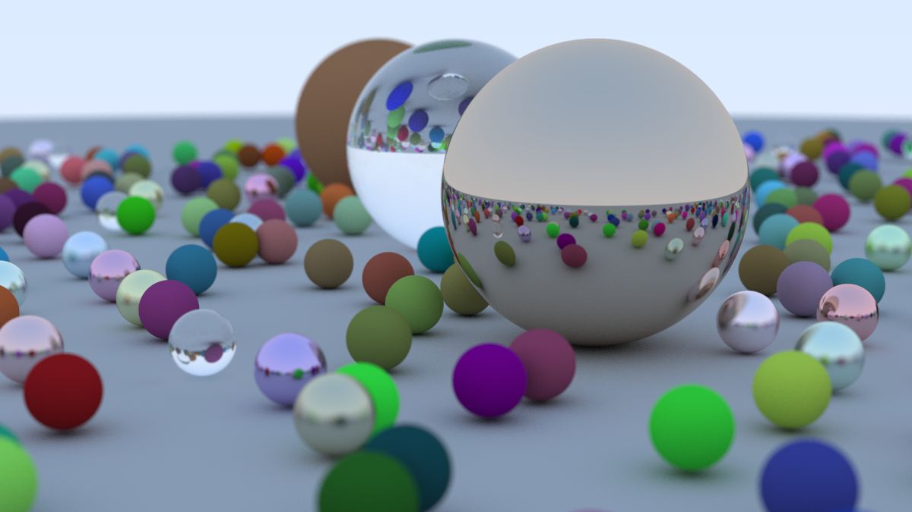

Follows the [Ray Tracing in One Weekend book](https://raytracing.github.io/books/RayTracingInOneWeekend.html) but in Rust instead of C++

Creates a ray traced scene like this from the cover of the book:

